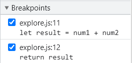
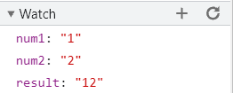
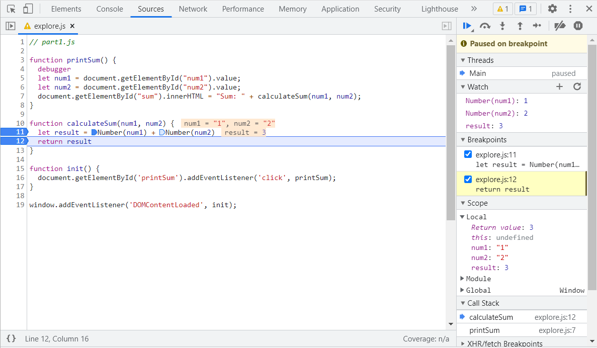

1. Both " num1 " and " num2 " are of type string, so " num1 + num2 " concatenate them together to get a string " result "  
   [result-calculateSum.png](./result-calculateSum.png)  
     
   [result-dataType.png](./result-dataType.png)  
     
2. Explicitly apply [Numeric Conversion] to " num1 " and " num2 " before adding them up.  
   [fix.png](./fix.png)  
   
